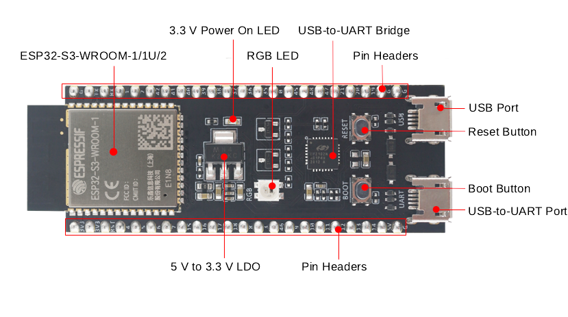

# ESP32-S3

Hardware reference for the prototyping target. Milestones M0 to M4 run on this chip.
See [milestones.md](milestones.md).

The numbers in this document are taken from the ESP32-S3 Series Datasheet v2.2.

## Board



Board photo: Espressif Systems, ESP32-S3-DevKitC-1 User Guide.

The board carries an ESP32-S3-WROOM-1 module, a USB-to-UART bridge, a 5 V to 3.3 V LDO,
a reset button and a boot button. Both USB connectors are Micro-USB on v1.0 and v1.1.

## SoC summary

| Item | Value |
|---|---|
| Core | Xtensa 32-bit LX7, dual core |
| Clock | Up to 240 MHz |
| Pipeline | Five stages |
| FPU | Single precision, per core |
| SIMD | 128-bit data bus, dedicated SIMD instructions |
| CoreMark | 1329.92 at 240 MHz, two cores |
| SRAM | 512 KB |
| ROM | 384 KB |
| RTC SRAM | 16 KB |
| eFuse | 4096 bits, 1792 bits available to the user |
| GPIO | 45 programmable |
| DMA | 5 transmit channels, 5 receive channels |
| Package | QFN56, 7 x 7 mm |
| Deep-sleep current | 7 uA |

Peripherals used by this project: 2 x I2S, 1 x USB OTG, 3 x UART.
Other peripherals: 2 x I2C, 2 x general-purpose SPI, LCD interface, DVP camera interface,
SD/MMC host, TWAI (CAN 2.0), RMT, LED PWM, 2 x MCPWM, 2 x 12-bit SAR ADC with 20 channels,
14 touch inputs, temperature sensor.

Wi-Fi 802.11 b/g/n and Bluetooth LE 5 are present. Cypherduck does not use them. Disabling
both in the ESP-IDF configuration returns their static allocations to the application.

Disabling the radio also removes an entropy source. `esp_random()` returns true random
numbers only while the RF subsystem is enabled, or while the SAR ADC entropy source is
enabled by `bootloader_random_enable()`, or while the second-stage bootloader runs. Its
output is pseudo-random otherwise. Milestones M0 to M4 generate no keys, so the radio stays
disabled. Any key generation on this chip requires one of the listed entropy sources.

## Memory

The 512 KB of SRAM is on the die. It is not divided between a fixed code region and a fixed
data region. The instruction bus and the data bus both address it.

External flash and PSRAM connect over SPI. The chip supports up to 1 GB of each. The cache
maps them into the CPU address space in 64 KB blocks, with these limits at any one time:

- 32 MB of instruction space, from flash or PSRAM.
- 32 MB of data space, from PSRAM. Flash can also be mapped here, read-only.

Flash and PSRAM are encrypted with XTS-AES when flash encryption is enabled.

The module part number states the sizes. `N` is the flash size in MB, `R` is the PSRAM size
in MB, and a trailing `V` means the PSRAM runs at 1.8 V. An ESP32-S3-WROOM-1-N8R8 module has
8 MB of flash and 8 MB of PSRAM. An N8 module has 8 MB of flash and no PSRAM.

To read the sizes from an attached board:

```
esptool.py -p /dev/ttyUSB0 flash_id
```

Cypherduck does not need PSRAM. At the M1 wire rate of 34.4 kB/s, a 250 ms audio buffer is
under 9 KB. The full audio path fits in internal SRAM.

## USB

The chip has two USB controllers:

| Controller | Function | Configurable descriptors |
|---|---|---|
| USB OTG | Full-speed, USB 2.0, device and host | Yes |
| USB Serial/JTAG | Serial console and JTAG debugging | No |

M0 requires a vendor-class interface, so Cypherduck uses the USB OTG controller in device
mode. The pins are GPIO19 (D-) and GPIO20 (D+), which reach the connector labelled
**USB Port** in the photo above.

The two controllers share one integrated transceiver. Time-division multiplexing is the only
way to run both, unless an external transceiver is added for the second controller. Treat
them as mutually exclusive: while the USB OTG controller drives the port, the USB Serial/JTAG
controller is not available.

The console therefore runs over the second connector, labelled **USB-to-UART Port**. That
connector reaches the USB-to-UART bridge chip, which drives UART0 on GPIO43 (TXD) and
GPIO44 (RXD). The bridge is a separate chip and is unaffected by the state of the USB OTG
controller. Both connectors also supply power to the board.

Device-mode endpoint limits:

- Endpoint 0, bidirectional, always present.
- Six further endpoints, numbers 1 to 6, each configurable as IN or OUT.
- Five IN endpoints active at one time, including endpoint 0 IN.

Cypherduck uses endpoint 0x01 for frames and endpoint 0x81 for status. This is one OUT
endpoint and one IN endpoint, well inside the limits.

## I2S

Two I2S controllers. Each one:

- Operates as master or slave.
- Operates full-duplex or half-duplex.
- Supports 8-bit, 16-bit, 24-bit and 32-bit samples.
- Supports a BCK frequency from 10 kHz to 40 MHz.
- Has a dedicated DMA controller.

Supported formats: TDM PCM, TDM MSB aligned, TDM LSB aligned, TDM Philips, and PDM.

The PCM5102A DAC is driven in Philips format at 16 bits. One controller is enough.

## Security

Hardware accelerators: AES (FIPS PUB 197), SHA (FIPS PUB 180-4), RSA, HMAC, RSA digital
signature, and a random number generator.

There is no ECC accelerator. X25519 runs in software.

There is no secure element. Key material is held in eFuse, and flash encryption plus Secure
Boot protect the image. This is the reason the production MCU recommendation is STM32U5.
Milestones M0 to M4 use no security hardware, so the difference does not affect them.

JTAG is disabled permanently by burning an eFuse. The strapping pin GPIO3 selects the JTAG
signal source during boot.

## Sources

- [ESP32-S3 Series Datasheet](https://documentation.espressif.com/esp32-s3_datasheet_en.pdf)
- [ESP32-S3-DevKitC-1 v1.1 User Guide](https://docs.espressif.com/projects/esp-dev-kits/en/latest/esp32s3/esp32-s3-devkitc-1/user_guide_v1.1.html)
